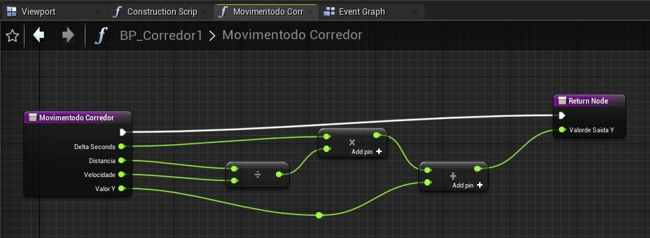
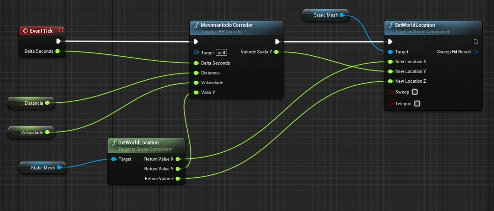
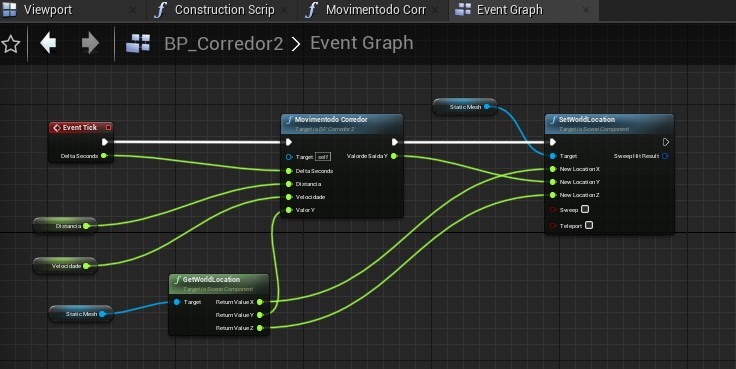
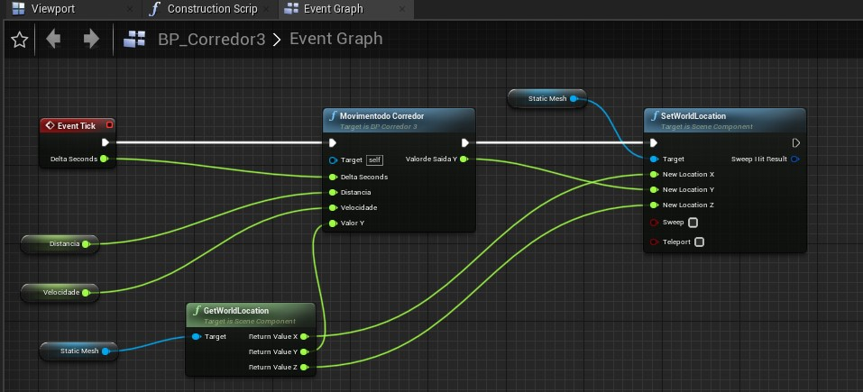

# Unreal Intermediario

# Utilizando Delta Seconds para controle de movimento.

1. Delta Time;
1. Delta Seconds;

## Delta Time

O que é **Delta Time**?

É o tempo entre cada frame.
Frame: Um quadro ou imagem apresentada, uma animação é composta por vários frames.

## Delta Seconds

Delta Seconds é a quantidade de tempo decorrido desde o último evento Tick. Ao multiplicar seu deslocamento por Delta Seconds, seu movimento será independente da taxa de quadros.
Por exemplo, seu peão tem uma velocidade máxima de 100. Se um segundo tivesse se passado desde o último tique de evento, seu peão moveria todas as 100 unidades. Se meio segundo tivesse passado, ele moveria 50 unidades.

## Utilizando o Delta Seconds

Utilizando o Delta Seconds não dependendo do FPS.

- Criado Blueprints tipo Actor (Chamados de BP_Corredor1, BP_Corredor2 e BP_Corredor3) para o exemplo:

- Em cada Actor foi inserido uma Static Mesh;

- No **BP_Corredor1**, no Event Graph, foi realizado os seguintes procedimentos:

- Criado as variáveis:
Velocidade = 10;
Distancia = 1000;

- Criado a Função Movimento do Corredor, Conforme imagem abaixo:

Após isso, No Event Graph, realizado a chamada da Função e os parâmetros para o moviemento do corredor:

Este procedimento foi realizado nos outros objetos (BP_Corredor2 e BP_Corredor3);

**BP_Corredor2:**

**BP_Corredor3**

## Video:

[Atividade BluePrints Intermediário - Unreal Engine 4](https://www.youtube.com/watch?v=m_LFZCGEiJM)

## Referências:

[CafeGeek / Desenvolvimento de jogos utilizando Unreal Engine 4](https://myerco.github.io/CafeGeek/ue4_blueprint/comunicacao_entre_blueprint.html#5)
